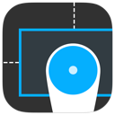

<a href="https://vimeo.com/98871620">Watch the teaser on Vimeo</a>
<br />
<a href="http://shaps.me/Peek">Designer? Read about Peek on my site</a>
<br />



#Peek


Introducing Peek, a tool to help your designers and testers get pixel perfect results when reviewing your User Interface.


####What is Peek?

Peek is an open source library that lets you easily and efficiently test your application against your user interface's specification guide.

Peek can be used by designers and testers, allowing developers to spend more time on code and less time testing that fonts, colors and layout are pixel perfect.

####Why use Peek

1. Peek doesn't require any code to get started
2. Peek is automatically disabled for release builds
3. No 3rd party code or libraries are used in Peek
4. Peek never inteferes with your apps normal behaviour, gestures or layout
5. Peek supports all orientations and devices.

*Note: Peek will automatically disable itself for builds that do not define DEBUG. See the [full documentation][docs] for details.*

####How do I install Peek?

Peek is a CocoaPod, so just include it in your Podfile and you're good to go. 
Not a single line of code is required to get started ;)

`pod 'Peek'`

Alternatively you can simply drag the files into your project and run! 
Again, no code is required to get started ;)

*Note: Peek tries not to interfere with any of your existing code, but there may be times where categories clash or Peek simply won't load. Check the **FAQ** below and if you still can't get Peek working correctly, create an issue here on GitHub and I'll get in touch with you as soon as I can.* 

####How do I present Peek?

After you've installed the codebase (either via CocoaPods or simply dragging Peek into your project) simply run your project on a device. The volume keys should now toggle Peek on and off while you use your app. It's that simple.

If you're running in the simulator however, the volume controls are not available, so Peek defaults to a shake gesture. You will need to write one method in your AppDelegate:

````objc
- (void)motionBegan:(UIEventSubtype)motion withEvent:(UIEvent *)event
{
  [[SPXPeek sharedInstance] handleShakeGesture];
}
````

*Note: Although this code is only required if using the Simulator, you may also need to implement this method if you set Peek's `presentationGesture` property to `SPXPeekPresentationGestureShake`

You can also present Peek from code, allowing you to define a custom gesture or button if you prefer. See the [full documentation][docs] for implementation details.

####How does Peek work?

Peek scans all the views in your entire view hierarchy that is currently on the screen then overlays these views with layout information. For technical details see the [full documentation][docs].

Peek then uses its comprehensive filtering system to best determine which views you care about and those that you are not likely to be interested in.

For example, by default Peek will not show you many of Apple's system components unless they are subclassed. A label however is a perfect exception to this, where you might not want to see all labels in a tab-bar but you do want to see the labels inside a cell.

Peek presents itself in its own window that sits directly on top of your own app's user interface to ensure that it doesn't interfere with normal functionality.

Peek also allows you to test all supported orientations on both iPhone and iPad.

####How do I see more information from Peek?

Double-tap anywhere on the screen to bring up more information about the currently selected view. Here peek will show you contextual information about the view you're inspecting. For example, a label will show information such as `font` and `textColor`, whereas an image might show information about its `size` or `contentMode`.

For quick access to color hex values, you can also tap-and-hold anywhere on the screen while Peek is active, to bring up the color loupe. Drag your finger over the screen to show HEX color values of anything under the loupe.

Finally, swipe-down with 2 fingers in Peek to display the filter options screen. Here you can toggle between filter sets to change context. For example, Peek can show you all the fonts used on the current screen, and then allow you to filter down to a specific font. This is useful for designers to determine if there's a label using the wrong font, without having to inspect each label manually.

####I'm a developer. Can I add more properties or filters to Peek?

Peek was designed from the ground up to be flexible and adding properties,representations and filters really showcase this flexibility.

Peek relies on a central store to persist state. This same store loads all the predefined properties, representations and filters at runtime. Filters can then be enabled/disabled by the user while using the app which are then persisted across launches.

The easiest way to learn how to add your own items to the store is to checkout `SPXPeekStoreConfiguration`

Here you can see that adding these items is a single line of code each ;)

```objc
PeekPropertyAdd(name, Class, keyPath);
PeekRepresentationAdd(name, Class, keyPath);
PeekFilterAdd(name, Class, block);
```

####Peek is hiding some views that I've customised. Can I prevent that?

Peek has a robust filtering system based on filter sets and their associated filters. Peek comes with a few defaults to provide fairly comprehensive filtering out-of-the-box. These filters should apply to 99% of cases, however there could certainly be cases where you need to disable a filter that's currently applied, or even remove it completely.

To disable a filter, you can do this within your app. While Peek is enabled, swipe-down with 2 fingers to display Peek's filtering options. Tap on Global Filters. Then simply locate the filter and tap on it to disable it. The checkmark icon indicates if the filter is being applied or not. Now when you return to Peek you will have access to the view.

This is useful for on-demand filtering, however you may want to enable this type of view by default. To do this use the code above.

By default, filtering is implicit. In order to show a view you must explicitly apply a filter for it. The first filter to return YES for a specified view wins. No more evaluation occurs. 


####Attribution

Original concept, code and app design by [@shaps][shaps]
<br />Filtering concept was inspired by some ideas from [Lee Atkinson][lee]
<br />Icon design by [@h1brd][marco]


[docs]: http://no_docs_url_yet
[shaps]: http://twitter.com/shaps "Shaps on Twitter"
[marco]: http://twitter.com/h1brd "Marco on Twitter"
[lee]: http://twitter.com/lee "Lee on Twitter"