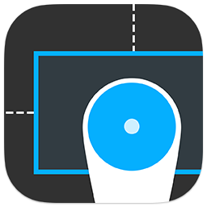

<a href="https://vimeo.com/98871620">Watch the teaser on Vimeo</a>
<br />
<br />



####Release Update

I must apologise for the delays in Peek's release but I still have a day job ;) and unfortunately client projects pay the bills. However, I am back onboard this weekend with a full release planned as well as updates to the future of Peek.

######Peek will officially release Monday 26th July.

Next I will be working on some known issues, new features and improvements.

Following that I have a nice little surprise coming every day this week. Short video's explaining some of Peeks features, how they work for testers and QA and how to customize Peek to your specific needs. Also please checkout this README ahead of release as its been updated.

Again I apologise for the delays but I promise it will be worth it when you see all that Peek can do for you. :)

#Peek

Introducing Peek, a tool to help your designers and testers get pixel perfect results when reviewing your User Interface.

### Table of Contents

**[What is Peek?](#what-is-peek)**    
**[Why use Peek](#why-use-peek)** 
**[How do I install Peek?](#how-do-i-install-peek)**  
**[How do I present Peek?](#how-do-i-present-peek)**  
**[How does Peek work?](#how-does-peek-work)**  
**[How do I see more information from Peek](#how-do-i-see-more-information-from-peek)**  
**[What are contexts?](#what-are-contexts)**  
**[Can I customize Peek for my own needs?](#im-a-developer-can-i-customize-peek-for-my-own-needs)**  

####What is Peek?

Peek is an open source library that lets you easily and efficiently test your application against your user interface's specification guide.

Peek can be used by designers and testers, allowing developers to spend more time on code and less time testing that fonts, colors and layout are pixel perfect.

####Why use Peek?

1. Peek doesn't require any code to get started
2. Peek is automatically disabled for release builds
3. No 3rd party code or libraries are used in Peek
4. Peek never inteferes with your apps normal behaviour, gestures or layout
5. Peek supports all orientations and devices.

*Note: Peek will automatically disable itself for builds that do not define DEBUG. See the [full documentation][docs] for details.*

####How do I install Peek?

Peek is a CocoaPod, so just include it in your Podfile and you're good to go. 
Not a single line of code is required to get started ;)

`pod 'Peek'`

Alternatively you can simply drag the files into your project and run! 
Again, no code is required to get started ;)

*Note: Peek tries not to interfere with any of your existing code, but there may be times where categories clash or Peek simply won't load. Check the **FAQ** below and if you still can't get Peek working correctly, create an issue here on GitHub and I'll get in touch with you as soon as I can.* 

####How do I present Peek?

After you've installed the codebase (either via CocoaPods or simply dragging Peek into your project) simply run your project on a device. The volume keys should now toggle Peek on and off while you use your app. It's that simple.

If you're running in the simulator however, the volume controls are not available, so Peek defaults to a shake gesture. You will need to write one method in your AppDelegate:

```objective-c
- (void)motionBegan:(UIEventSubtype)motion withEvent:(UIEvent *)event
{
  [[SPXPeek sharedInstance] handleShakeGesture];
}
```

*Note: Although this code is only _required_ if using the Simulator, you will also need to implement this method if you set Peek's `presentationGesture` property to `SPXPeekPresentationGestureShake`

You can also present Peek from code, allowing you to define a custom gesture or button if you prefer. See the [full documentation][docs] for implementation details.

####How does Peek work?

Peek scans all the views in your entire view hierarchy that is currently on the screen then overlays these views with layout information. For technical details see the [full documentation][docs].

Peek then uses its comprehensive filtering system to best determine which views you care about and those that you are not likely to be interested in.

For example, by default Peek will not show you many of Apple's system components unless they are subclassed. A label however is a perfect exception to this, where you might not want to see all labels in a tab-bar but you do want to see the labels inside a cell.

Peek presents itself in its own window that sits directly on top of your own app's user interface to ensure that it doesn't interfere with normal functionality.

Peek also allows you to test all supported orientations on both iPhone and iPad.

####How do I see more information from Peek?

Peek comes pre-packed with various gestures for presenting more information about your app.

__Tap__ and/or __drag__ around the screen to highlight the views in your user interface.

__Swipe up__ with __2 fingers__ to hide the currently selected view. This is especially useful if that view is obscuring some other views you care about. Hiding views is on a per-session basis, so closing and reopening Peek resets all hidden views.

__Double-tap__ anywhere on the screen to present contextual information about the currently selected view. For example, a label will show information such as `font` and `textColor`, whereas an image might show information about its `size` or `contentMode`.

__Swipe-down__ with __2 fingers__ to switch context, allowing you to focus on a specific task. By default Peek comes with the following contexts:

1. Show Layout Information
2. Filter by Font
3. Inspect Color Values

####What are contexts?

A context is basically a task you want to perform. For example if you wanted to create a context that shows font information in your app, you can use the 'Filter by Font' context to have Peek show you only information about text fields in your app and the fonts they are using. 

Contexts have the following configurable attributes, allowing you to easily create more:

1. Properties
2. View overlay
3. Filters

####I'm a developer. Can I customize Peek for my own needs?

Peek was designed from the ground up to be flexible. The following attributes are completely customizable in Peek:

1. Properties
2. Property Representations
3. Contexts
4. Filters
5. View Overlays

In fact many of these attributes also support dynamic configurations allowing you to inspect your UI at runtime and provide filters and properties that are completely contextual. To see an example of this, checkout `SPXConfigurations` to see how the 'Filter by Font' context is setup.

Contexts rely on filters to decide what content it should present. However, filters can also be enabled/disabled by the user while using the app.

Customizing Peek couldn't be simpler, in fact if you checkout `SPXPeekConfigurations` you'll have all the documenation you'll need to get started, since this is where the defaults are created ;)

Peek even provides convenient macros and functions to make it even easier to configure (in fact these are the recommended way of setting up Peek):

__Static configurations__

```smalltalk
peekAddProperty(name, class, keyPath)
peekAddRepresentation(name, class, keyPath)
peekAddContext(name, overlayClass, filters, ...)
```

__Dynamic Configurations__

```smalltalk
peekAddContextWithBlock(name, overlayClass, dynamicFiltersBlock)
peekAddFilterWithBlock(name, context, evaluationBlock)
peekAddRepresentationWithBlock(name, class, valueForRepresentationBlock)
peekSetCellClassWithBlock(cellClass, objectClass, configureCellBlock)
```

####Links

Read more on <a href="http://shaps.me/Peek">http://shaps.me/Peek</a>
<br />Original concept, code and app design by [@shaps][shaps]
<br />Icon design by [@h1brd][marco]

####Thanks

Special thanks to the [The App Business][tab] for supporting my project.<br />
[Krzysztof][krzys], thanks for some awesome ideas around macros and runtime inspection.<br />
[Sam Dods][sam], inspired some of the assertion macros, based on Krzysztof's original concept.

[docs]: http://no_docs_url_yet "Full Documentation"
[shaps]: http://twitter.com/shaps "Me on Twitter"

[marco]: http://twitter.com/h1brd "Marco on Twitter"
[sam]: http://twitter.com/dodsios "Sam on Twitter"
[krzys]: http://twitter.com/merowing_ "Krzysztof on Twitter"
[tab]: http://theappbusiness.com "The App Business"
